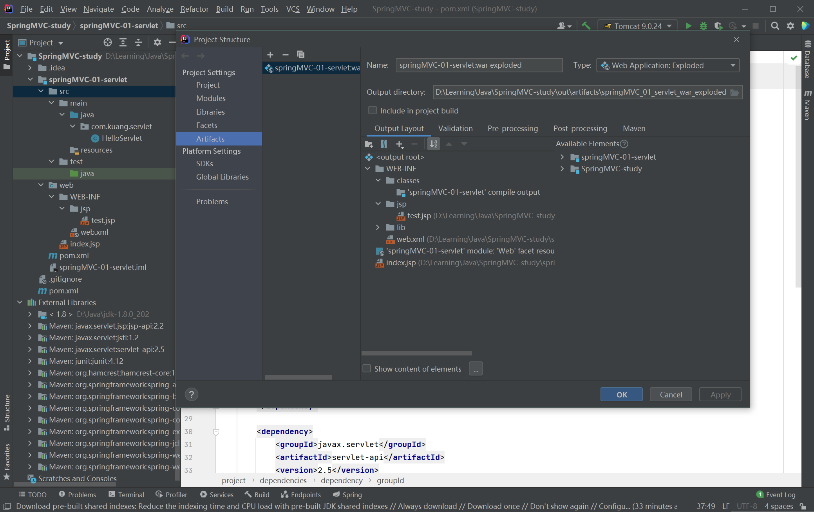
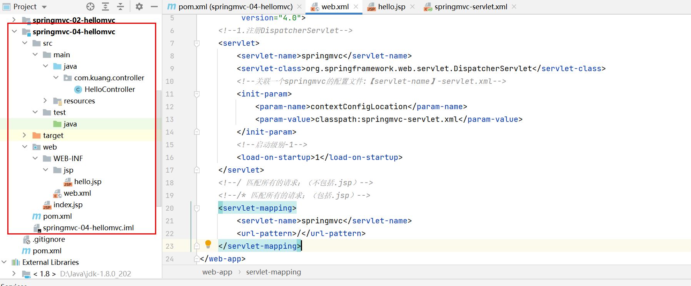
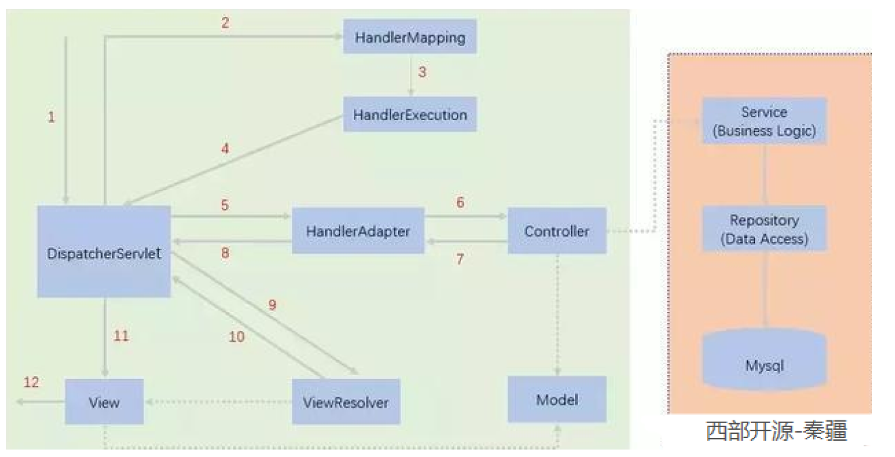

- [问题1. Tomcat地狱bug，404](#问题1-tomcat地狱bug404)
- [Servlet、jsp、javabean在MVC中所扮演的角色及Tomcat](#servletjspjavabean在mvc中所扮演的角色及tomcat)
- [springMVC的执行原理及流程](#springmvc的执行原理及流程)
- [web.xml里需要注意](#webxml里需要注意)
- [maven静态资源过滤问题](#maven静态资源过滤问题)
- [spring框架中的database.properties](#spring框架中的databaseproperties)
- [spring里的数据库连接池](#spring里的数据库连接池)
- [ssm整合：spring层](#ssm整合spring层)
- [问题bug，spring文件的约束写错](#问题bugspring文件的约束写错)
- [问题bug：Usermapper.xml文件中的SQL语句问题](#问题bugusermapperxml文件中的sql语句问题)
- [疑点：mvc:default-servlet-handler/ 是 Spring MVC 框架中的一个配置标签](#疑点mvcdefault-servlet-handler-是-spring-mvc-框架中的一个配置标签)
- [疑点：并没有把bookMapper这个接口在spring里用bean进行注册](#疑点并没有把bookmapper这个接口在spring里用bean进行注册)
- [疑点：int updateBook()的返回值为什么是int](#疑点int-updatebook的返回值为什么是int)
- [疑点：前端提交的表单里的参数，后端是如何接收到的](#疑点前端提交的表单里的参数后端是如何接收到的)
- [问题bug: web.xml里面dispatcherServlet的参数里关于servlet的配置文件问题](#问题bug-webxml里面dispatcherservlet的参数里关于servlet的配置文件问题)
- [疑点：在WEB-INF目录下的所有页面或者资源](#疑点在web-inf目录下的所有页面或者资源)
- [疑点：HttpSession](#疑点httpsession)


## 问题1. Tomcat地狱bug，404
究极http 404问题
out文件夹的输出里面没有WEB-INFO文件夹，也没有index.jsp文件，没有jsp文件夹，查了好多资料后，仍未完全解决。

最终解决方案是，project structure，artifacts，在里面手动添加目录结构和文件，甚至是lib里的依赖包，总之要让这个out下面的目录结构和文件与web下面的完全相同。


此时只能手动，我也不知道是idea版本的问题还是什么的问题，排除了好多可能性，依赖包的版本，环境变量的设置，Tomcat的设置，web文件夹的小蓝点是否存在，project stucture里面facets和artifacts的配置路径是否正确等等等等。

解决了！！！！！最终是换了一个idea的版本，2021.1.4的版本，一切都会自动输出和加载，不需要手动了。真他妈巨坑。

后来写的时候又遇到过404，还是idea的问题，需要手动在out里面加入lib依赖。

这里坑还有，也就是每次在pom.xml添加一个依赖包，还要进project structure里面在lib里再添加上这个新的包，否则就会报错。

## Servlet、jsp、javabean在MVC中所扮演的角色及Tomcat

servlet是一种技术，也是一个java类，主要负责接受客户端服务器发出的HTTP请求，处理请求并生成响应，一般包括执行业务逻辑以及数据库操作，一般和javaBean协同，将javaBean作为数据模型，使用javaBean处理请求，然后再将结果生成响应，如转到html前端页面等，因此是一种动态web技术。一般在java程序中我们会写一个继承自HttpServlet类的类，重写里面的一些方法，如doGet，doPost等，以实现业务。

而Tomcat则是一个web服务器和servlet容器，它是用于托管和执行servlet，当浏览器发送请求到Tomcat时，Tomcat把请求传递到servlet进行处理，Tomcat管理着servlet的生命周期，请求的分发，线程管理，会话管理等等。

而jsp则是用于生成html和页面展示，它是一种所谓的模板引擎技术，可以在html页面中嵌入java代码，用于生成动态web内容，它的执行原理也是servlet类，客户端请求访问一个jsp页面时，jsp引擎会把jsp文件编译为一个servlet类，再在服务器上执行生成的servlet代码。

至于javaBean则是业务逻辑和数据操作所依赖的数据模型，它也是一个java类，用于数据封装和处理。

所以javaBean是Model，而jsp更像是Viewer的角色，视图页面，servlet则是Controller的角色，也就是一个调度，接受请求，把请求交给数据模型进行处理，然后再把结果返回给视图，由视图负责展示。

## springMVC的执行原理及流程

首先，DispatcherServlet是整个springMVC的控制中心，负责分发请求到不同的controller，他接收http请求，通过HandlerMapping，这是一种映射，通过这种映射可以找到具体执行的controller控制器，而这个controller要做的就是处理请求，调用业务层进行业务和数据操作，最后返回一个ModelAndView，模型和视图，返回给DispatchServlet，DispatchServlet调用ViewResolver视图解析器，找到具体的视图名字，最终渲染出视图。



## web.xml里需要注意

servlet-mapping里面的url-pattern指的是我们要去处理的http请求，例如http://localhost:8080，后再加http://localhost:8080/hello，这里这个hello就是一个新的请求。而下面的/指的是我们要处理/后的所有请求。如果下面写的是/hello，那么指的是要处理/hello之后的所有请求才会走servlet。
```xml
<servlet-mapping>
    <servlet-name>springmvc</servlet-name>
    <url-pattern>/</url-pattern>
</servlet-mapping>
```

另外，/表示只匹配所有的请求，不会去匹配jsp页面，而/*则表示匹配所有的请求，包括jsp页面。但由于我们将会用viewResolver视图解析器来拼接请求页面的名字，因此如果客户端要请求http://localhost:8080/a.jsp，那么a.jsp页面会在拼接的时候出问题。

## maven静态资源过滤问题

[mybatis里需要把java下的xml文件给过滤掉](https://blog.csdn.net/SHILIKNG/article/details/116983128?spm=1001.2101.3001.6650.2&utm_medium=distribute.pc_relevant.none-task-blog-2%7Edefault%7EBlogCommendFromBaidu%7ERate-2-116983128-blog-117930947.235%5Ev38%5Epc_relevant_anti_vip&depth_1-utm_source=distribute.pc_relevant.none-task-blog-2%7Edefault%7EBlogCommendFromBaidu%7ERate-2-116983128-blog-117930947.235%5Ev38%5Epc_relevant_anti_vip&utm_relevant_index=1)

## spring框架中的database.properties

在 Spring 框架中，database.properties 文件通常是用于存储数据库连接相关的配置信息的属性文件。这些配置信息包括数据库的连接URL、用户名、密码、驱动程序类名等。通过将这些配置信息存储在属性文件中，可以实现配置的分离，便于在不同环境下进行配置切换和管理。

具体来说，database.properties 文件的作用包括：

配置数据库连接信息： 在实际应用中，连接数据库需要提供一些关键信息，如数据库连接URL、用户名、密码、数据库驱动程序类名等。将这些敏感信息存储在属性文件中可以避免将其硬编码在代码中，提高了安全性和可维护性。

分离配置： 使用属性文件可以将数据库连接的配置与代码逻辑分离开来。这意味着你可以在不同的环境中（如开发、测试、生产）使用不同的属性文件，而不需要修改应用程序的代码。

简化配置： 在 Spring 中，你可以使用 PropertyPlaceholderConfigurer 或 PropertySourcesPlaceholderConfigurer 等配置类来加载属性文件中的配置信息，并将其注入到 Spring 的配置文件或 Java Bean 中，从而使得配置变得更加简洁和可读。

提供配置切换： 通过使用不同的属性文件，你可以实现在不同的环境下切换配置。例如，在开发环境下使用一个属性文件，而在生产环境下使用另一个属性文件，从而避免了手动修改配置的麻烦。

示例 database.properties 文件内容：

```
properties
Copy code
# Database Configuration
db.url=jdbc:mysql://localhost:3306/mydb
db.username=root
db.password=secret
db.driver=com.mysql.jdbc.Driver

```
在 Spring 配置文件中加载属性文件：

```xml
<bean class="org.springframework.beans.factory.config.PropertyPlaceholderConfigurer">
    <property name="locations">
        <list>
            <value>classpath:database.properties</value>
        </list>
    </property>
</bean>
```
然后可以在 Spring 配置文件或 Java Bean 中使用 ${} 表达式来引用属性值，例如：

```xml
Copy code
<bean id="dataSource" class="org.apache.commons.dbcp.BasicDataSource">
    <property name="url" value="${db.url}" />
    <property name="username" value="${db.username}" />
    <property name="password" value="${db.password}" />
    <property name="driverClassName" value="${db.driver}" />
</bean>
```

## spring里的数据库连接池

在 Spring 框架中，数据库连接池（Database Connection Pool）是用于管理和维护数据库连接的一种技术，它的主要作用是提高数据库访问性能、资源利用率和应用程序的响应时间。数据库连接池通过预先创建一组数据库连接，并在需要时将连接提供给应用程序，从而减少了连接创建和释放的开销。

以下是数据库连接池的一些主要作用：

提高性能： 数据库连接的创建和释放是一个相对昂贵的操作，涉及网络通信和数据库资源的分配。连接池可以在应用程序启动时创建一组连接，并将这些连接保持在池中，供应用程序随时使用。这减少了每次请求都需要创建新连接的开销，从而提高了数据库访问性能。

资源利用率： 数据库连接是有限资源，不适当地创建过多的连接可能会导致资源浪费或数据库服务器过载。连接池可以管理连接的数量，并确保连接的合理利用，避免过多的连接占用资源。

连接复用： 连接池可以对连接进行复用，即当一个连接被释放后，它可以被另一个请求重新使用，从而减少了连接的开销和资源消耗。

连接管理： 连接池可以监控连接的状态，并在连接超时、失效或发生异常时自动重新创建或释放连接，从而确保连接的稳定性和可靠性。

减少连接泄漏： 使用连接池可以减少连接泄漏的风险。如果应用程序不正确地释放连接，可能会导致数据库连接泄漏，最终导致数据库资源不足。连接池可以自动管理连接的生命周期，避免这种问题。

配置和管理： 数据库连接池可以根据应用程序的需求进行配置，包括最大连接数、最小连接数、连接超时等。这使得连接池可以根据应用程序的负载和需求进行动态调整。

Spring 框架本身并不包含数据库连接池的实现，但它提供了对多个第三方连接池的集成支持，例如 Apache Commons DBCP、HikariCP、Tomcat JDBC 等。通过配置 Spring 数据源和连接池，你可以在 Spring 应用程序中轻松地使用数据库连接池来管理数据库连接，提高性能和可伸缩性。

## ssm整合：spring层

这里涉及到mybatis-spring的一些使用，在这里新添加了一种动态地将Dao接口注入到Spring的一种方式，利用MapperScannerConfigurer类，MapperScannerConfigurer 是 Spring 框架中用于扫描 MyBatis 映射器（Mapper）接口的配置类。它的作用是自动扫描指定的包路径，将符合条件的 MyBatis 映射器接口注册为 Spring 的 Bean，从而将这些映射器接口交由 Spring 管理。

在此之前的老方式，是创建一个mapper接口的实现类，要么把sqlSessionTemplate作为这个类的一个私有属性，然后在Spring配置文件中利用sqlSessionTemplate来注入sqlSession。要么让这个实现类继承sqlSessionDaoSupport，那么就可以直接利用sqlSessionFactory来注入。无论如何都需要另外写这样一个实现类。

## 问题bug，spring文件的约束写错

问题描述：org.xml.sax.SAXParseException; lineNumber: 13; columnNumber: 69; schema_reference.4: 无法读取方案文档 'https://www.springframework.org/schema/context/springbeans.xsd', 原因为 1) 无法找到文档; 2) 无法读取文档; 3) 文档的根元素不是 <xsd:schema>

后经过查找，发现https://www.springframework.org/schema/context/springbeans.xsd这里应该写为spring-beans.xsd，少了一个横杠。


## 问题bug：Usermapper.xml文件中的SQL语句问题

遇到一个bug，表示bookId没有对应的getter方法，但是显然我的代码里是配置了getter方法的，查了一下，这种问题大多是参数名字写错了。然后我检查了一下，确实数据库列名和pojo类里都是bookID，而这里是bookId，之所以之前没出问题，主要是因为在Usermapper接口里，我用@Param进行了方法参数的注解，把参数名给改掉了
```xml
Books queryBookById(@Param("bookId") int id);
```

经查，如果没有用@Param注解进行重命名，那么mapper.xml里的sql语句的占位符，需要和数据库列名保持完全一致，否则就会报500错误。这个@Param注解的对于占位符的重命名只在对应的映射文件xml文件生效，其他地方无须管。

## 疑点：<mvc:default-servlet-handler/> 是 Spring MVC 框架中的一个配置标签

一般在springmvc的配置文件中都会写上，作用如下：

用于配置默认的 Servlet 处理器。它的主要作用是将请求交给 Web 容器的默认 Servlet 处理，用于处理静态资源，如图片、CSS、JavaScript 文件等。

在传统的 Servlet 规范中，每个 Web 应用程序都有一个默认的 Servlet，通常命名为 "default" 或 "defaultServlet"，它负责处理未匹配到其他 Servlet 的请求。这个默认的 Servlet 可以处理静态资源请求，如根据 URL 路径返回对应的静态文件内容。

在 Spring MVC 中，默认情况下，DispatcherServlet 负责处理所有的请求，包括动态请求和静态资源请求。但对于静态资源请求，通常直接交给默认的 Servlet 处理效率更高，因为默认的 Servlet 通常是 Web 容器的一部分，对静态资源的处理会更加优化。

使用 <mvc:default-servlet-handler/> 可以将静态资源的请求交给默认的 Servlet 处理，从而提高性能和效率。这个标签会自动配置一个 DefaultServletHttpRequestHandler，用于处理静态资源请求。


## 疑点：并没有把bookMapper这个接口在spring里用bean进行注册

查了一下，在spring里，接口一般不会注册，而是把他们的实现类进行bean注册，因为IOC的思想，多态嘛，把接口作为方法参数，用set方法把实体类注入进去，所以依赖注入一般是指的把实体类注入进去。

之所以在这个项目里有这样的疑问，是把UserServiceImpl实现类进行注册的时候：

```xml
<bean id="BookServiceImpl" class="com.kuang.service.BookServiceImpl">
        <property name="bookMapper" ref="bookMapper"/>
</bean>
```

service层调用dao层，因此要把bookMapper进行私有化，然而我发现这个bookMapper接口并没有bean注册，所以产生疑问。答案是因为我们写了bookMapper.xml这个文件，里面的mapper标签，在 MyBatis 中，<mapper> 标签用于将 Mapper 接口与对应的 SQL 映射文件关联起来，这样 MyBatis 在扫描 Mapper 接口时会自动将其注册为 bean，无需在 Spring 配置文件中再显式定义 <bean>。


## 疑点：int updateBook()的返回值为什么是int

我的项目里有一个mapper.xml文件里面对于方法updateBook是这样写的：
```xml
<update id="updateBook" parameterType="Books">
        update ssmbuild.books set bookName=#{bookName}, bookCounts=#{bookCounts},detail=#{detail}
        where bookID=#{bookID}
</update>
```
 而且mapper接口里的updateBook方法是这样声明的：int updateBook(Books books); 
 
 所以返回值为什么是int类型以及这个返回值到底是什么？

 在 MyBatis 中，执行更新操作时，<update> 标签中的 SQL 语句会更新数据库中的记录。在这个更新过程中，数据库会返回一个整数值，表示受影响的行数，即更新了多少条记录。

 这个方法的返回值类型是 int，它与 <update> 标签中的 SQL 语句的执行结果相关。在执行更新操作后，MyBatis 会返回一个表示受影响行数的整数值。这个值会被映射到方法的返回值，因此方法返回的是更新操作影响的行数。

如果更新操作成功，返回的整数值通常是大于 0 的数，表示有记录被更新。如果更新操作没有影响任何记录，返回的整数值可能是 0，表示没有记录被更新。

其余的insert和delete都会返回这个int，只有query返回的是查询的结果。

## 疑点：前端提交的表单里的参数，后端是如何接收到的

在前端的表单中，你使用了 name 属性来指定每个输入字段的名称，这些名称会作为参数传递给后端。因为你的 Books 类中的属性和前端表单中的输入字段名称是一致的，Spring MVC 能够自动将请求参数映射到 Books 对象的属性上，实现数据的绑定。

前端代码如下：
```html
<form action="${pageContext.request.contextPath}/book/addBook" method="post">
        <div class="form-group">
            <label>书籍名称：</label>
            <input type="text" name="bookName" class="form-control" >
        </div>
        <div class="form-group">
            <label>书籍数量：</label>
            <input type="text" name="bookCounts" class="form-control">
        </div>
        <div class="form-group">
            <label>书籍描述：</label>
            <input type="text" name="detail" class="form-control">
        </div>
        <div class="form-group">
            <input type="submit" class="form-control" value="添加">
        </div>
    </form>
```

具体来说，前端的表单提交时，根据 name 属性指定的参数名称，Spring MVC 会将这些参数值绑定到对应的 Books 对象属性上。在你的控制器方法中，使用 Books 参数接收这些参数值，并将其自动注入为一个 Books 对象。

在你的控制器中的这段代码：

```java
@RequestMapping("/addBook")
public String addBook(Books books) {
    System.out.println("addBook=>" + books);
    bookService.addBook(books);
    return "redirect:/book/allBook";
}
```
Books 对象 books 是通过请求参数的名称和表单中的输入字段的名称进行映射的。Spring MVC 会将请求参数中的值自动填充到 books 对象的对应属性上。

因此，前端表单中的 bookName、bookCounts、detail 会被映射到 Books 对象的相应属性上。这样，你就能够在控制器中直接使用 books 对象，它会包含前端传递过来的属性值。

总结：前端的表单提交会根据 name 属性将数据绑定到后端的参数上，Spring MVC 会自动映射请求参数到控制器方法的参数中，实现数据的自动绑定。因此，在控制器中直接使用 Books 参数，可以直接获取前端传递的属性值。


## 问题bug: web.xml里面dispatcherServlet的参数里关于servlet的配置文件问题

之前我们把servlet的配置文件写成了springmvc.xml，并不是总的，然后就报错出现了500问题，找不到其他层的bean。

```xml
<!--DispatcherServlet-->
<servlet>
<servlet-name>DispatcherServlet</servlet-name>
<servletclass>
org.springframework.web.servlet.DispatcherServlet</servlet-class>
<init-param>
<param-name>contextConfigLocation</param-name>
<!--一定要注意:我们这里加载的是总的配置文件，之前被这里坑了！-->
<param-value>classpath:applicationContext.xml</param-value>
</init-param>
<load-on-startup>1</load-on-startup>
</servlet>
```

## 疑点：在WEB-INF目录下的所有页面或者资源

只能通过controller或者servlet进行访问，不能通过/*.jsp请求直接访问。


## 疑点：HttpSession

HttpSession 是 Java Web 应用程序中的一个重要的服务器端会话管理机制，它允许在多个请求之间跟踪和维护用户的状态信息。通过 HttpSession，Web 应用程序可以在用户访问网站时存储和获取数据，而不需要将所有数据都嵌入到每个请求中。

以下是 HttpSession 的一些关键特点和用法：

会话的创建和销毁： HttpSession 对象在用户访问 Web 应用程序时创建，并在一段时间内保持活动状态。会话可以在用户关闭浏览器、超时或通过代码显式销毁时终止。

数据存储和检索： 通过 HttpSession，你可以将数据存储在会话中，以便在用户的多个请求之间共享和保留状态。这对于存储用户登录信息、购物车内容、用户设置等很有用。

会话标识： 每个 HttpSession 都有一个唯一的标识符（session ID），它通常是通过 cookie 在用户的浏览器中进行传递。服务器使用 session ID 来识别特定用户的会话。

属性操作： 你可以在 HttpSession 中存储属性（键值对），以便存储和检索用户状态。常见的操作包括添加、获取和删除属性。

并发处理： Web 容器负责管理 HttpSession 的并发访问。它会确保只有一个请求可以修改 HttpSession 中的数据，以避免数据不一致性。

超时管理： HttpSession 有一个超时时间，定义了会话在没有活动的情况下保持多长时间。如果超过超时时间，会话会被自动销毁。

在 Java 中，使用 HttpServletRequest 对象可以访问 HttpSession。以下是一个简单的示例：

```java
Copy code
// 获取 HttpSession 对象
HttpSession session = request.getSession();

// 向 HttpSession 中添加属性
session.setAttribute("username", "john");

// 从 HttpSession 中获取属性
String username = (String) session.getAttribute("username");

// 从 HttpSession 中移除属性
session.removeAttribute("username");

// 获取会话 ID
String sessionID = session.getId();
```
总之，HttpSession 是 Java Web 应用程序中用于管理用户会话状态的机制，允许在多个请求之间共享和保留用户数据。这对于实现用户状态管理和数据共享非常有用。


